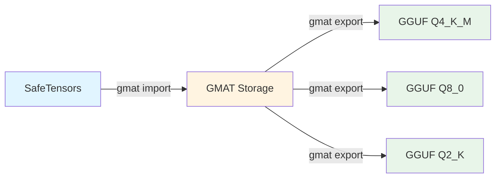

<div align="center">
  <!-- Logo placeholder - replace with actual logo when available -->
  
  
  <h1>GMAT-CLI</h1>
  
  <p><strong>CPU-only SafeTensors to GGUF converter for Large Language Models</strong></p>
</div>

<div align="center">

[](https://www.rust-lang.org/)
[](LICENSE)
[](wiki/Installation.md)

</div>

---

## Why GMAT-CLI?

**GMAT-CLI** is a model management tool that converts HuggingFace SafeTensors models to GGUF format with advanced quantization control. Unlike GPU-dependent tools, GMAT-CLI runs entirely on CPU, making it accessible on any machine.

### Key Benefits

- **CPU-Only Operation**: No GPU or CUDA required. Runs on any server, laptop, or cloud instance with just a CPU.
- **70B+ Model Support**: Streaming architecture handles models larger than available RAM. Convert 70B+ parameter models on modest hardware.
- **Full Quantization Control**: Support for Q2_K through Q8_0, including K-quant and I-quant families. Per-tensor precision overrides for critical layers.
- **Multi-Architecture Support**: Works with text models (Llama, Qwen, Phi), vision-language models (LLaVA, Qwen-VL), and encoder-decoder models (T5, BART, Whisper).

### The GMAT Advantage

GMAT uses tensor-addressed storage as an intermediate format between training and inference:

- **Quantization as Configuration**: Store once, deploy many ways. Same source model generates multiple quantization profiles.
- **Reproducible Builds**: JSON configuration files provide a full audit trail of quantization decisions.
- **Per-Tensor Precision**: Keep embeddings at Q8_0 while using Q4_K_M for feed-forward layers.

---

## Quick Start

```bash
# 1. Install (requires Rust 1.70+)
cargo install gmat-cli

# 2. Import: SafeTensors → GMAT
gmat import --model ./model.safetensors --config import_config.json -o ./gmat_output

# 3. Export: GMAT → GGUF with quantization
gmat export --model ./gmat_output/model.gmat --config export_config.json -o model-q4.gguf
```

> See [Installation](wiki/Installation.md) for detailed setup instructions.

---

## How It Works

GMAT-CLI uses a two-phase workflow with an intermediate tensor-addressed storage format:



1. **Import Phase**: Convert SafeTensors to GMAT format with block-encoded, log-domain representation.
2. **Export Phase**: Generate GGUF files with custom quantization profiles from the same GMAT source.

This separation enables:
- Multiple deployment variants from a single source
- Consistent quantization across fine-tuned models
- Version-controlled configuration files

> See [Import Command](wiki/Import-Command.md) and [Export Command](wiki/Export-Command.md) for detailed usage.

---

## Supported Architectures

GMAT-CLI supports a wide range of model architectures:

| Category | Architectures |
|----------|---------------|
| **Text Models** | Llama, Qwen, Phi, Gemma, DeepSeek, Mistral, Mixtral (MoE) |
| **Vision-Language** | LLaVA, Qwen-VL, Kimi-VL, InternVL |
| **Encoder-Decoder** | T5, BART, Whisper |

### Quantization Types

| Type | Description | Use Case |
|------|-------------|----------|
| **Q2_K** - **Q6_K** | K-quant family | Balanced quality/size tradeoff |
| **IQ4_XS**, **IQ4_NL** | I-quant variants | Improved 4-bit quality |
| **Q4_0**, **Q5_0**, **Q8_0** | Legacy formats | Maximum compatibility |

> See [Export Command](wiki/Export-Command.md) for detailed quantization options and quality comparisons.

---

## Hardware Requirements

| Component | Minimum | Recommended |
|-----------|---------|-------------|
| **CPU** | 4+ cores | 8+ cores |
| **RAM** | 8 GB (for <7B models) | 32 GB (for 70B+ models) |
| **Storage** | 2-3x model size | NVMe SSD preferred |
| **GPU** | Not required | Not used |

### Operating System Support

- Linux (primary platform)
- macOS
- Windows WSL2

> See [Technical Details](wiki/Technical-Details.md) for memory efficiency and streaming architecture.

---

## Documentation

Full documentation is available in the [wiki](wiki/Home.md):

- [Home](wiki/Home.md) - Overview and navigation hub
- [Installation](wiki/Installation.md) - Setup and prerequisites
- [Import Command](wiki/Import-Command.md) - SafeTensors to GMAT conversion
- [Export Command](wiki/Export-Command.md) - GMAT to GGUF quantization
- [Configuration Files](wiki/Configuration-Files.md) - JSON config schema and examples
- [Technical Details](wiki/Technical-Details.md) - Block encoding and quantization algorithms
- [FAQ](wiki/FAQ.md) - Common questions and troubleshooting

---

## Examples

### Tiny LLM (Quick Start)
The `example/tiny_llm` directory contains a minimal workflow with a small test model. Perfect for learning the basic import/export process.

### Kimi2-VL (Production Scale)
The `example/kimi2` directory demonstrates processing a 16B MoE vision-language model with 9,197 tensors across 7 shards. See [example/kimi2/README.md](example/kimi2/README.md) for details.

---

## Contributing

Contributions are welcome! Please:

1. Check existing issues or create a new one for discussion
2. Fork the repository and create a feature branch
3. Submit a pull request with clear description of changes

For major changes, please open an issue first to discuss your proposal.

---

## License

This project is licensed under the MIT License. See [LICENSE](LICENSE) for details.
