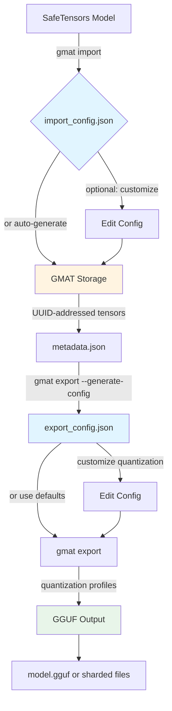

# Configuration Files

Configuration files are JSON documents that control how GMAT CLI imports models and exports them with quantization. They enable precise control over tensor handling, quantization strategies, and output formatting.

## Overview

GMAT CLI uses two types of configuration files:

- **`import_config.json`**: Controls SafeTensors/GGUF to GMAT conversion (tensor mapping, block format, metadata preservation)
- **`export_config.json`**: Controls GMAT to GGUF export (quantization settings, per-tensor overrides, sharding)

These configurations enable:
- Per-tensor quantization control (preserve embeddings at Q8_0, compress attention at Q4_K_M)
- Automatic tensor name translation (SafeTensors names → GMAT UUIDs → GGUF names)
- Multi-file sharding for large models (70B+ split into 5GB chunks)
- Block format optimization for memory efficiency
- Model metadata preservation across conversions

## Configuration Workflow



**Workflow explanation**:
1. Import uses optional `import_config.json` (auto-generated with `--generate-config` or manually created)
2. GMAT storage contains UUID-addressed tensors and `metadata.json` with tensor mappings
3. Export uses `export_config.json` (auto-generated from metadata with `--generate-config`)
4. Manual editing enables per-tensor quantization overrides and custom settings
5. Final GGUF output can be single file or sharded

---

## File Location and Naming

### Import Configuration
- **Default location**: `./import_config.json` (current working directory)
- **Custom location**: Use `--config <path>` flag with `gmat import`
- **Auto-generation**: `gmat import --generate-config <model.safetensors>`

### Export Configuration
- **Default location**: `./export_config.json` (current working directory)
- **Custom location**: Use `--config <path>` flag with `gmat export`
- **Auto-generation**: `gmat export --generate-config <gmat-model-dir>`

### GMAT Metadata
- **Location**: `<gmat-model-dir>/metadata.json` (created during import)
- **Purpose**: Maps tensor names to UUIDs, stores model architecture info
- **Usage**: Referenced when generating export configs

---

## Complete Schema Documentation

### Import Configuration Schema

```json
{
  "source_format": "safetensors",
  "block_format": "B8x8",
  "tensor_map": [
    {
      "source": "model.embed_tokens.weight",
      "target": "550e8400-e29b-41d4-a716-446655440000",
      "include": true
    }
  ],
  "metadata": {
    "architecture": "llama",
    "vocab_size": 32000,
    "hidden_size": 4096,
    "num_layers": 32,
    "num_attention_heads": 32,
    "intermediate_size": 11008,
    "max_position_embeddings": 4096
  }
}
```

#### Import Fields

| Field | Type | Required | Default | Description |
|-------|------|----------|---------|-------------|
| `source_format` | string | Yes | `"safetensors"` | Source format: `"safetensors"` or `"gguf"` |
| `block_format` | string | Yes | `"B8x8"` | Block encoding format (see [Block Formats](#block-format-options)) |
| `tensor_map` | array | Yes | `[]` | Tensor mappings (source name → UUID) |
| `metadata` | object | Yes | `{}` | Model architecture metadata |

#### Tensor Mapping (Import)

| Field | Type | Required | Description |
|-------|------|----------|-------------|
| `source` | string | Yes | Source tensor name from SafeTensors/GGUF (e.g., `"model.embed_tokens.weight"`) |
| `target` | string | Yes | UUID for GMAT storage (e.g., `"550e8400-e29b-41d4-a716-446655440000"`) |
| `include` | boolean | Yes | Whether to include this tensor (set `false` to exclude) |

#### Model Metadata

| Field | Type | Required | Description |
|-------|------|----------|-------------|
| `architecture` | string | Optional | Model architecture: `"llama"`, `"mistral"`, `"qwen"`, `"phi"`, `"gemma"`, etc. |
| `vocab_size` | integer | Optional | Vocabulary size (e.g., 32000 for LLaMA, 151936 for Qwen2) |
| `hidden_size` | integer | Optional | Hidden dimension size (e.g., 4096 for LLaMA-7B) |
| `num_layers` | integer | Optional | Number of transformer layers |
| `num_attention_heads` | integer | Optional | Number of attention heads |
| `intermediate_size` | integer | Optional | FFN intermediate size (typically ~2.7x hidden_size) |
| `max_position_embeddings` | integer | Optional | Maximum sequence length |

---

### Export Configuration Schema

```json
{
  "target_format": "gguf",
  "quantization": {
    "default_type": "q4_k_m",
    "scale_optimization": "trellis",
    "trellis_lambda": 0.3,
    "per_tensor": {
      "550e8400-e29b-41d4-a716-446655440000": "q8_0",
      "3b6d6f4a-9cf5-4d97-9b08-ce07ddc0435d": "q6_k"
    }
  },
  "tensor_map": [
    {
      "source": "550e8400-e29b-41d4-a716-446655440000",
      "target": "token_embd.weight"
    },
    {
      "source": "3b6d6f4a-9cf5-4d97-9b08-ce07ddc0435d",
      "target": "output.weight"
    }
  ],
  "shard_size": null
}
```

#### Export Fields

| Field | Type | Required | Default | Description |
|-------|------|----------|---------|-------------|
| `target_format` | string | Yes | `"gguf"` | Target format (currently only `"gguf"` supported) |
| `quantization` | object | Optional | `null` | Quantization settings (if omitted, no quantization applied) |
| `tensor_map` | array | Yes | `[]` | Tensor export mappings (UUID → GGUF name) |
| `shard_size` | integer/null | Optional | `null` | Shard size in bytes (null = single file) |

#### Quantization Configuration

| Field | Type | Required | Default | Description |
|-------|------|----------|---------|-------------|
| `default_type` | string | Yes | `"q8_0"` | Default quantization type for all tensors |
| `scale_optimization` | string | Optional | `"trellis"` | Scale optimization: `"trellis"` (quality) or `"standard"` (speed) |
| `trellis_lambda` | float | Optional | `0.3` | Trellis lambda parameter (0.1-0.3 = detail, 0.5-1.0 = smoothness) |
| `per_tensor` | object | Optional | `{}` | Per-tensor quantization overrides (UUID → quant_type string) |

**Supported quantization types**: `q2_k`, `q3_k_s`, `q3_k_m`, `q3_k_l`, `q4_0`, `q4_1`, `q4_k_s`, `q4_k_m` (default), `q5_0`, `q5_1`, `q5_k_s`, `q5_k_m`, `q6_k`, `q8_0`, `iq4_xs`, `iq4_nl`

See [Export Command - Quantization Types](Export-Command.md#quantization-types) for detailed comparison.

#### Tensor Mapping (Export)

| Field | Type | Required | Description |
|-------|------|----------|-------------|
| `source` | string | Yes | GMAT tensor UUID (from `metadata.json`) |
| `target` | string | Yes | Target tensor name in GGUF format (e.g., `"token_embd.weight"`, `"blk.0.attn_q.weight"`) |

#### Sharding Configuration

| Value | Description |
|-------|-------------|
| `null` | Single GGUF file (recommended for models <10GB) |
| `5000000000` | 5GB shards (recommended for cloud storage, ~70B models) |
| `8000000000` | 8GB shards (balanced option for large models) |

Output files named as: `model-00001-of-00005.gguf`, `model-00002-of-00005.gguf`, etc.

---

## Section Breakdown

### Model Section (Import)

The model section in `import_config.json` defines the source model characteristics:

```json
{
  "source_format": "safetensors",
  "block_format": "B8x8",
  "metadata": {
    "architecture": "llama",
    "vocab_size": 32000
  }
}
```

**Purpose**: Identifies model architecture and configures block encoding strategy.

**Key decisions**:
- `source_format`: Always `"safetensors"` for PyTorch/HuggingFace models
- `block_format`: Choose based on model size and memory constraints (see [Block Format Options](#block-format-options))
- `metadata.architecture`: Determines automatic tensor name translation rules

---

### Quantization Section (Export)

The quantization section in `export_config.json` controls compression strategy:

```json
{
  "quantization": {
    "default_type": "q4_k_m",
    "scale_optimization": "trellis",
    "trellis_lambda": 0.3,
    "per_tensor": {}
  }
}
```

**Purpose**: Sets global quantization type and optimization parameters.

**Key decisions**:
- `default_type`: Applied to all tensors unless overridden (Q4_K_M recommended default)
- `scale_optimization`: Trellis (quality, default) vs Standard (speed)
- `trellis_lambda`: 0.3 default balances quality and compression (lower = more detail)
- `per_tensor`: Override specific tensors (see [Per-Tensor Overrides](#per-tensor-override-section))

**Trellis optimization**: Improves quantization quality by optimizing scale factor selection with smoothness penalty. Use `"standard"` only for legacy compatibility or maximum speed.

---

### Per-Tensor Override Section

The `per_tensor` object maps UUIDs to custom quantization types:

```json
{
  "per_tensor": {
    "e268e395-888f-49ed-9f59-24ea9d10be77": "q8_0",
    "3b6d6f4a-9cf5-4d97-9b08-ce07ddc0435d": "q6_k",
    "df11f72a-85ce-41e1-b354-1253749bd43d": "q4_k_m"
  }
}
```

**Common override patterns**:

| Tensor Type | Recommended Quant | Rationale |
|-------------|-------------------|-----------|
| Embeddings (`token_embd.weight`) | `q8_0` or `q6_k` | Preserve vocabulary quality |
| Output layer (`output.weight`) | `q8_0` or `q6_k` | Critical for generation quality |
| Attention Q/K/V | `q4_k_m` or `q5_k_m` | Balance quality and size |
| Attention output | `q5_k_m` | Important for accuracy |
| FFN gate/up/down | `q4_k_m` | Can be compressed more |
| Layer norms | `q8_0` | Small, preserve precision |

**Automatic recommendations**: Use `gmat export --generate-config` with `--importance-high` and `--importance-medium` thresholds to auto-generate per-tensor overrides based on octave-shift ratio analysis.

---

### Output Section (Export)

The output section controls file generation:

```json
{
  "target_format": "gguf",
  "shard_size": 5000000000,
  "tensor_map": [...]
}
```

**Purpose**: Defines output format and sharding strategy.

**Sharding guidelines**:
- Models <10GB: `"shard_size": null` (single file)
- Models 10-50GB: `"shard_size": 8000000000` (8GB shards, balanced)
- Models >50GB: `"shard_size": 5000000000` (5GB shards, cloud-friendly)

**Tensor map**: Maps GMAT UUIDs to GGUF tensor names. Auto-generated based on architecture. Manual editing rarely needed unless custom tensor naming required.

---

## Per-Tensor Override Patterns

### By Tensor UUID (Direct Mapping)

Most common method using exact UUID strings:

```json
{
  "per_tensor": {
    "550e8400-e29b-41d4-a716-446655440000": "q8_0",
    "7c9e6679-7425-40de-944b-e07fc1f90ae7": "q6_k"
  }
}
```

**How to find UUIDs**: Check `<gmat-model-dir>/metadata.json` for `tensor_name_map` section:

```json
{
  "tensor_name_map": {
    "model.embed_tokens.weight": "550e8400-e29b-41d4-a716-446655440000",
    "lm_head.weight": "7c9e6679-7425-40de-944b-e07fc1f90ae7"
  }
}
```

### By Tensor Name (Using Metadata)

Use `metadata.json` to map original tensor names to UUIDs, then add to `per_tensor`:

**Step 1**: Identify tensor name in metadata:
```bash
# Find embedding tensor UUID
grep "embed_tokens" gmat-model/metadata.json
# Output: "model.embed_tokens.weight": "550e8400-..."
```

**Step 2**: Add UUID to config:
```json
{
  "per_tensor": {
    "550e8400-e29b-41d4-a716-446655440000": "q8_0"
  }
}
```

### Bulk Override Pattern (All Layers)

For models with many layers, use scripting to generate overrides:

```python
import json

# Load metadata to get all UUIDs
with open('gmat-model/metadata.json') as f:
    metadata = json.load(f)

# Generate overrides for all attention layers
per_tensor = {}
for name, uuid in metadata['tensor_name_map'].items():
    if 'attn_q' in name or 'attn_k' in name:
        per_tensor[uuid] = 'q5_k_m'  # Higher quality for Q/K
    elif 'attn_v' in name or 'attn_output' in name:
        per_tensor[uuid] = 'q4_k_m'  # Standard quality for V/O

# Update export config
with open('export_config.json') as f:
    config = json.load(f)
config['quantization']['per_tensor'] = per_tensor

with open('export_config.json', 'w') as f:
    json.dump(config, f, indent=2)
```

### Importance-Based Pattern (Automatic)

Use automatic importance analysis to generate overrides:

```bash
# Generate config with automatic importance thresholds
gmat export --generate-config gmat-model/ \
  --importance-high 0.25 \
  --importance-medium 0.15
```

**How it works**:
- Analyzes octave-shift ratio for each tensor (measures variance distribution)
- High importance (>0.25): Uses Q8_0 or Q6_K (embeddings, output)
- Medium importance (0.15-0.25): Uses Q5_K_M (attention)
- Low importance (<0.15): Uses default Q4_K_M (FFN, layer norms)

Generated `export_config.json` will have automatic `per_tensor` entries based on analysis.

---

## Example Configurations

### Minimal Config (Quick Start)

**Import** (`import_config.json`):
```json
{
  "source_format": "safetensors",
  "block_format": "B8x8",
  "tensor_map": [],
  "metadata": {
    "architecture": "llama"
  }
}
```

**Export** (`export_config.json`):
```json
{
  "target_format": "gguf",
  "quantization": {
    "default_type": "q4_k_m"
  },
  "tensor_map": []
}
```

Use `--generate-config` to auto-populate `tensor_map` arrays.

---

### Full Config with All Options

**Import** (`import_config.json`):
```json
{
  "source_format": "safetensors",
  "block_format": "B16x8",
  "tensor_map": [
    {
      "source": "model.embed_tokens.weight",
      "target": "550e8400-e29b-41d4-a716-446655440000",
      "include": true
    },
    {
      "source": "model.layers.0.self_attn.q_proj.weight",
      "target": "df11f72a-85ce-41e1-b354-1253749bd43d",
      "include": true
    },
    {
      "source": "model.norm.weight",
      "target": "8bc97abd-918e-4b33-9bb2-cc57761bfbc6",
      "include": true
    },
    {
      "source": "lm_head.weight",
      "target": "3b6d6f4a-9cf5-4d97-9b08-ce07ddc0435d",
      "include": true
    }
  ],
  "metadata": {
    "architecture": "llama",
    "vocab_size": 32000,
    "hidden_size": 4096,
    "num_layers": 32,
    "num_attention_heads": 32,
    "intermediate_size": 11008,
    "max_position_embeddings": 4096
  }
}
```

**Export** (`export_config.json`):
```json
{
  "target_format": "gguf",
  "quantization": {
    "default_type": "q4_k_m",
    "scale_optimization": "trellis",
    "trellis_lambda": 0.3,
    "per_tensor": {
      "550e8400-e29b-41d4-a716-446655440000": "q8_0",
      "3b6d6f4a-9cf5-4d97-9b08-ce07ddc0435d": "q6_k",
      "df11f72a-85ce-41e1-b354-1253749bd43d": "q5_k_m",
      "8bc97abd-918e-4b33-9bb2-cc57761bfbc6": "q8_0"
    }
  },
  "tensor_map": [
    {
      "source": "550e8400-e29b-41d4-a716-446655440000",
      "target": "token_embd.weight"
    },
    {
      "source": "3b6d6f4a-9cf5-4d97-9b08-ce07ddc0435d",
      "target": "output.weight"
    },
    {
      "source": "df11f72a-85ce-41e1-b354-1253749bd43d",
      "target": "blk.0.attn_q.weight"
    },
    {
      "source": "8bc97abd-918e-4b33-9bb2-cc57761bfbc6",
      "target": "output_norm.weight"
    }
  ],
  "shard_size": null
}
```

---

### High-Quality Config (Embeddings Preserved)

For maximum quality with minimal compression:

```json
{
  "target_format": "gguf",
  "quantization": {
    "default_type": "q5_k_m",
    "scale_optimization": "trellis",
    "trellis_lambda": 0.2,
    "per_tensor": {
      "550e8400-e29b-41d4-a716-446655440000": "q8_0",
      "3b6d6f4a-9cf5-4d97-9b08-ce07ddc0435d": "q8_0",
      "8bc97abd-918e-4b33-9bb2-cc57761bfbc6": "q8_0"
    }
  },
  "tensor_map": [...],
  "shard_size": null
}
```

**Strategy**:
- Default Q5_K_M (5.5 bpw, high quality baseline)
- Embeddings/output at Q8_0 (8.5 bpw, near-lossless)
- Layer norms at Q8_0 (small tensors, preserve precision)
- Trellis lambda 0.2 (emphasis on detail preservation)

**Use case**: Research, evaluation, models where quality is critical.

---

### Size-Optimized Config (Maximum Compression)

For minimum file size with acceptable quality:

```json
{
  "target_format": "gguf",
  "quantization": {
    "default_type": "q3_k_m",
    "scale_optimization": "trellis",
    "trellis_lambda": 0.4,
    "per_tensor": {
      "550e8400-e29b-41d4-a716-446655440000": "q4_k_m",
      "3b6d6f4a-9cf5-4d97-9b08-ce07ddc0435d": "q4_k_m"
    }
  },
  "tensor_map": [...],
  "shard_size": 5000000000
}
```

**Strategy**:
- Default Q3_K_M (3.5 bpw, aggressive compression)
- Embeddings/output at Q4_K_M (4.5 bpw, reasonable quality)
- Trellis lambda 0.4 (emphasis on smoothness for compressed data)
- Sharding at 5GB for cloud deployment

**Use case**: Edge deployment, bandwidth-constrained environments, models where size matters most.

---

### Sharded Config for 70B Model

```json
{
  "target_format": "gguf",
  "quantization": {
    "default_type": "q4_k_m",
    "scale_optimization": "trellis",
    "trellis_lambda": 0.3,
    "per_tensor": {
      "550e8400-e29b-41d4-a716-446655440000": "q6_k",
      "3b6d6f4a-9cf5-4d97-9b08-ce07ddc0435d": "q6_k"
    }
  },
  "tensor_map": [...],
  "shard_size": 5000000000
}
```

**Output**: `llama-70b-00001-of-00008.gguf`, `llama-70b-00002-of-00008.gguf`, etc.

**Strategy**:
- 5GB shards for cloud storage compatibility
- Q4_K_M default (balanced quality/size)
- Q6_K for embeddings/output (preserve critical tensors)

---

## Block Format Options

Available block formats for import configuration:

| Format | Description | Memory Efficiency | Use Case |
|--------|-------------|-------------------|----------|
| `B8x4` | 8-element blocks, 4-bit magnitude | Highest compression | Small models, memory-constrained |
| `B8x8` | 8-element blocks, 8-bit magnitude | **Recommended default** | General purpose, balanced |
| `B16x4` | 16-element blocks, 4-bit magnitude | High compression, larger blocks | Medium models |
| `B16x8` | 16-element blocks, 8-bit magnitude | High precision, larger blocks | Large models, quality focus |
| `B8x4DualRow` | 8-element dual-row, 4-bit magnitude | Optimized for structured tensors | Experimental |
| `B8x8DualRow` | 8-element dual-row, 8-bit magnitude | Balanced dual-row | Experimental |
| `B16x4DualRow` | 16-element dual-row, 4-bit magnitude | Compressed dual-row | Experimental |
| `B16x8DualRow` | 16-element dual-row, 8-bit magnitude | Precision dual-row | Experimental |

**Recommendation**: Use `B8x8` (default) unless you have specific memory constraints or quality requirements. See [Technical Details - Block Encoding](Technical-Details.md#block-encoding) for implementation details.

---

## Validation and Error Messages

### Import Configuration Errors

| Error | Cause | Solution |
|-------|-------|----------|
| `Missing required field: source_format` | `source_format` not specified | Add `"source_format": "safetensors"` |
| `Invalid block_format: B32x8` | Unsupported block format | Use one of: B8x4, B8x8, B16x4, B16x8, or DualRow variants |
| `Invalid UUID format: abc-123` | Malformed UUID in tensor_map | Use valid UUIDv4 format (e.g., `550e8400-e29b-41d4-a716-446655440000`) |
| `Duplicate source tensor: model.embed_tokens.weight` | Same source tensor mapped twice | Remove duplicate entries in `tensor_map` |
| `Unknown architecture: custom_model` | Unsupported architecture | Use supported architecture or omit field |

### Export Configuration Errors

| Error | Cause | Solution |
|-------|-------|----------|
| `Unknown quantization type: q9_0` | Unsupported quant type | Use valid type: q2_k-q8_0, iq4_xs, iq4_nl |
| `Invalid trellis_lambda: 5.0` | Lambda out of range | Use 0.0-1.0 range (typically 0.1-0.5) |
| `UUID not found in metadata: 550e8400-...` | UUID doesn't exist in GMAT model | Check `metadata.json` for valid UUIDs |
| `Shard size too small: 1000000` | Shard size <100MB | Use null or >=1GB (1000000000) |
| `Invalid scale_optimization: fast` | Unknown optimization mode | Use `"trellis"` or `"standard"` |
| `per_tensor must be object, got array` | Wrong type for per_tensor | Use object: `{"uuid": "q8_0"}`, not array |

### GMAT Metadata Errors

| Error | Cause | Solution |
|-------|-------|----------|
| `metadata.json not found` | GMAT model directory invalid | Verify import completed successfully |
| `Invalid JSON in metadata.json` | Corrupted metadata file | Re-import model with `gmat import` |
| `tensor_name_map is empty` | No tensors imported | Check import_config.json includes tensors |

---

## Tips and Best Practices

### 1. Always Generate Configs First

Use `--generate-config` to create templates, then customize:

```bash
# Import: Generate config from SafeTensors model
gmat import --generate-config model.safetensors

# Review and edit import_config.json
# Then run actual import:
gmat import --config import_config.json model.safetensors output-dir/

# Export: Generate config from GMAT model
gmat export --generate-config output-dir/

# Review and edit export_config.json
# Then run actual export:
gmat export --config export_config.json output-dir/ model.gguf
```

### 2. Preserve Embeddings and Output Layers

These tensors significantly impact quality. Use Q8_0 or Q6_K:

```json
{
  "per_tensor": {
    "<embedding-uuid>": "q8_0",
    "<output-uuid>": "q6_k"
  }
}
```

### 3. Use Importance Analysis for Large Models

For 13B+ models with hundreds of tensors, automate per-tensor overrides:

```bash
gmat export --generate-config gmat-model/ \
  --importance-high 0.25 \
  --importance-medium 0.15
```

This generates optimized `per_tensor` entries based on octave-shift ratio analysis.

### 4. Shard Large Models for Cloud Deployment

Models >10GB should be sharded for easier distribution:

```json
{
  "shard_size": 5000000000  // 5GB chunks
}
```

Output: `model-00001-of-N.gguf`, `model-00002-of-N.gguf`, etc.

### 5. Tune Trellis Lambda for Your Use Case

| Lambda | Effect | Use Case |
|--------|--------|----------|
| 0.1-0.2 | Maximum detail preservation | Research, evaluation, high-quality inference |
| 0.3 (default) | Balanced quality/smoothness | General purpose, recommended |
| 0.4-0.5 | Emphasis on smoothness | Size-optimized, aggressive compression |

### 6. Exclude Unnecessary Tensors

Set `include: false` for tensors you don't need (reduces storage):

```json
{
  "tensor_map": [
    {
      "source": "model.vision_tower.encoder.layers.0.weight",
      "target": "...",
      "include": false  // Skip vision tower for text-only deployment
    }
  ]
}
```

### 7. Validate Configs Before Large Exports

Test with small model first to catch configuration errors:

```bash
# Quick validation on tiny model
gmat export --config export_config.json tiny-gmat-model/ test-output.gguf

# If successful, run on full model
gmat export --config export_config.json large-gmat-model/ output.gguf
```

### 8. Keep Metadata Accurate

Fill in `metadata` section for better documentation and automatic name translation:

```json
{
  "metadata": {
    "architecture": "llama",
    "vocab_size": 32000,
    "hidden_size": 4096,
    "num_layers": 32
  }
}
```

### 9. Use Standard Quantization for Debugging

If experiencing quality issues, switch to standard optimization to isolate problem:

```json
{
  "scale_optimization": "standard",  // Faster, simpler
  "trellis_lambda": 0.0  // Ignored in standard mode
}
```

### 10. Document Custom Overrides

Add comments (in separate README) explaining per-tensor choices:

```json
{
  "per_tensor": {
    "550e8400-...": "q8_0",  // embedding: preserve vocabulary quality
    "3b6d6f4a-...": "q6_k",  // output: critical for generation
    "df11f72a-...": "q5_k_m"  // attn_q: higher quality for attention
  }
}
```

---

## Next Steps

- **[Technical Details](Technical-Details.md)**: Deep dive into block encoding and quantization algorithms
- **[Import Command](Import-Command.md)**: Learn how to use import configurations
- **[Export Command](Export-Command.md)**: Learn how to use export configurations and quantization
- **[FAQ](FAQ.md)**: Common questions about configuration and quantization
