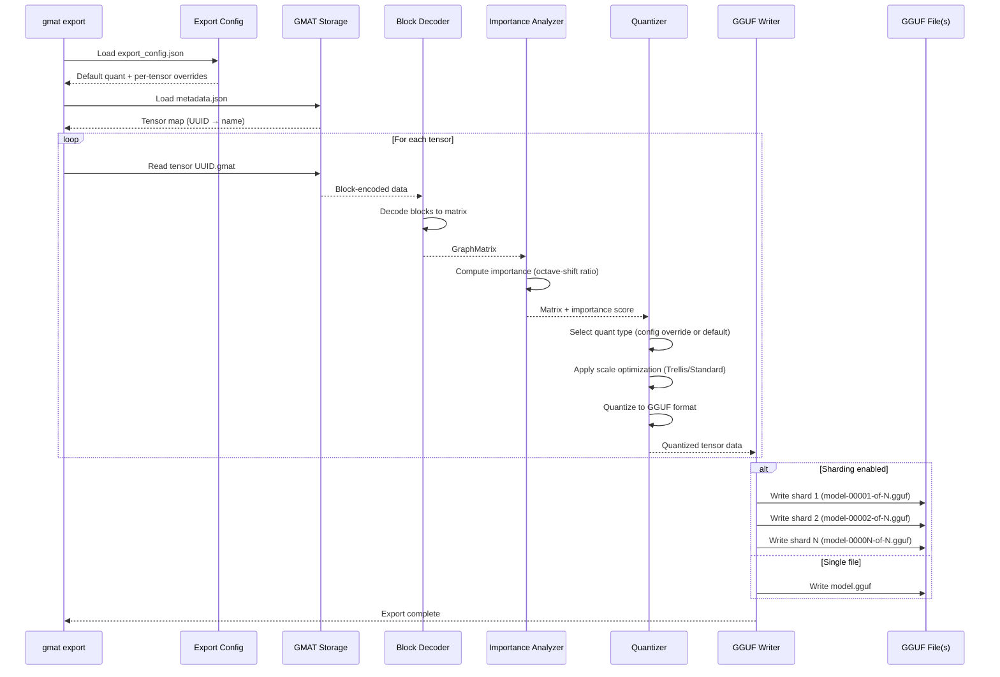

# Export Command

## Purpose

The `export` command converts GMAT models to GGUF format with configurable quantization. It reads tensor-addressed GMAT storage, applies per-tensor quantization strategies, and produces GGUF files ready for inference with llama.cpp and compatible runtimes.

**Key capabilities:**
- Multiple quantization types (Q2_K through Q8_0, K-quant, I-quant families)
- Per-tensor quantization overrides for quality optimization
- Trellis scale optimization for improved quantization quality
- Automatic importance-based quantization recommendations
- Sharding support for large models
- Parallel processing with streaming output

## Export Flow



## Command Syntax

```bash
gmat export [OPTIONS]
```

## Options

| Option | Short | Description | Default |
|--------|-------|-------------|---------|
| `--model <PATH>` | `-m` | Path to GMAT model directory (required) | - |
| `--config <PATH>` | `-c` | Path to export configuration JSON | `export_config.json` |
| `--output <PATH>` | `-o` | Output GGUF file path | `model.gguf` |
| `--shard-size <BYTES>` | | Shard size in bytes (e.g., 5000000000 for 5GB). Overrides config. | None |
| `--generate-config` | | Generate export_config.json template and exit | - |
| `--importance-high <FLOAT>` | | Importance threshold for high-quality quant (with --generate-config) | 0.2 |
| `--importance-medium <FLOAT>` | | Importance threshold for medium-quality quant (with --generate-config) | 0.1 |

## Quantization Types

### Legacy Quantization

| Type | Bits/Weight | Use Case | Notes |
|------|-------------|----------|-------|
| `q4_0` | 4.5 | Legacy compatibility | Superseded by Q4_K_M |
| `q4_1` | 5.0 | Legacy compatibility | Superseded by Q4_K_M |
| `q5_0` | 5.5 | Legacy compatibility | Superseded by Q5_K_M |
| `q5_1` | 6.0 | Legacy compatibility | Superseded by Q5_K_M |
| `q8_0` | 8.5 | High quality, minimal compression | Use for critical tensors |

### K-Quantization (Recommended)

K-quants use block-wise quantization with per-block scales and min values for better quality than legacy formats.

| Type | Bits/Weight | Quality | Use Case | Notes |
|------|-------------|---------|----------|-------|
| `q2_k` | ~2.6 | Lowest | Extreme compression | Significant quality loss |
| `q3_k_s` | ~3.5 | Low | Small variant | 3-bit with reduced overhead |
| `q3_k_m` | ~3.9 | Low-Medium | Medium variant | Better than q3_k_s |
| `q3_k_l` | ~4.3 | Medium | Large variant | Best 3-bit quality |
| `q4_k_s` | ~4.6 | Medium | Small variant | Faster, lower quality |
| **`q4_k_m`** | **~5.0** | **Good** | **Default, balanced** | **Recommended starting point** |
| `q5_k_s` | ~5.5 | High | Small variant | Good quality/size tradeoff |
| `q5_k_m` | ~6.0 | High | Medium variant | Better than q5_k_s |
| `q6_k` | ~6.6 | Very High | High-importance tensors | Near-fp16 quality |

### I-Quantization (Importance-Weighted)

I-quants use non-linear lookup tables and importance weighting for higher quality than K-quants at similar sizes.

| Type | Bits/Weight | Quality | Status | Notes |
|------|-------------|---------|--------|-------|
| **`iq4_xs`** | **~4.25** | **High** | ✅ Implemented | 4-bit with group scales, better than Q4_K_M |
| **`iq4_nl`** | **~4.0** | **High** | ✅ Implemented | 4-bit non-linear LUT, very efficient |
| `iq3_xxs` | ~3.0 | Medium | ❌ Not implemented | Planned |
| `iq3_s` | ~3.4 | Medium | ❌ Not implemented | Planned |
| `iq2_xxs` | ~2.0 | Low | ❌ Not implemented | Planned |
| `iq2_xs` | ~2.3 | Low | ❌ Not implemented | Planned |
| `iq2_s` | ~2.5 | Low | ❌ Not implemented | Planned |
| `iq1_s` | ~1.5 | Very Low | ❌ Not implemented | Extreme compression |
| `iq1_m` | ~1.75 | Very Low | ❌ Not implemented | Extreme compression |

**Quality recommendations:**
- For maximum quality: `q8_0` or `q6_k`
- For balanced quality/size: `q4_k_m` (default) or `iq4_xs`
- For smaller size: `q3_k_m` or `iq4_nl`
- For extreme compression: `q2_k` (quality degrades significantly)

## Trellis Optimization

Trellis optimization improves quantization quality by minimizing quantization error with a smoothness penalty. It optimizes scale factors across blocks to reduce artifacts.

**Configuration:**

```json
{
  "quantization": {
    "scale_optimization": "trellis",
    "trellis_lambda": 0.3
  }
}
```

**Parameters:**
- `scale_optimization`: `"trellis"` (default) or `"standard"`
- `trellis_lambda`: Smoothness penalty weight (default: 0.3)
  - Higher values (0.5-1.0): Smoother scale transitions, may reduce sharpness
  - Lower values (0.1-0.3): Preserve more detail, may introduce artifacts
  - Recommended: 0.3 for most models

**When to use:**
- **Trellis (default)**: Best for most models, improves quality at no computational cost
- **Standard**: Legacy mode, faster but lower quality

## Per-Tensor Quantization Overrides

Export config allows per-tensor quantization overrides to optimize quality for critical tensors.

**Example configuration:**

```json
{
  "quantization": {
    "default_type": "q4_k_m",
    "scale_optimization": "trellis",
    "trellis_lambda": 0.3,
    "per_tensor": {
      "550e8400-e29b-41d4-a716-446655440000": "q8_0",
      "7c9e6679-7425-40de-944b-e07fc1f90ae7": "q6_k",
      "9b3f0a85-2b45-4e93-9d5c-8e0f6a2c1b3d": "iq4_xs"
    }
  }
}
```

**Automatic recommendations:**

When generating config with `--generate-config`, the tool analyzes tensor importance (octave-shift ratio) and recommends quantization types:

| Tensor Type | Importance | Recommendation |
|-------------|------------|----------------|
| Token embeddings (`embed_tokens`) | High (>0.2) | `q8_0` |
| Token embeddings | Medium | `q6_k` |
| LM head (`lm_head`) | High (>0.2) | `q8_0` |
| LM head | Medium | `q6_k` |
| Output norm (`model.norm`) | Any | `q6_k` or `q8_0` |
| Attention output (`o_proj`) | High (>0.1) | `q6_k` |
| Attention output | Low | `q5_k_m` |
| Attention value (`v_proj`) | High (>0.1) | `q6_k` |
| Attention value | Low | `q5_k_m` |
| FFN down projection (`mlp.down_proj`) | High (>0.1) | `q6_k` |
| FFN down projection | Low | `q5_k_m` |
| Attention Q/K projections | Any | `q4_k_m` |
| FFN gate/up projections | Any | `q4_k_m` |
| Small tensors (<1M params) | Any | `q8_0` |

**Customizing thresholds:**

```bash
gmat export --model ./model.gmat --generate-config \
  --importance-high 0.3 \
  --importance-medium 0.15
```

## Sharding

Sharding splits large GGUF files into multiple shards for easier distribution and handling.

**Via command line (overrides config):**

```bash
gmat export --model ./model.gmat \
  --config export_config.json \
  --output model.gguf \
  --shard-size 5000000000  # 5GB per shard
```

**Via configuration file:**

```json
{
  "shard_size": 5000000000
}
```

**Output naming:**
- Input: `model.gguf`
- Sharded output: `model-00001-of-00003.gguf`, `model-00002-of-00003.gguf`, `model-00003-of-00003.gguf`

**Recommended shard sizes:**
- 4-5GB: Good for cloud storage with size limits
- 8-10GB: Balanced for most use cases
- No sharding: Single file for small models (<10GB)

## Workflow Examples

### Basic Export

Generate config, review, and export:

```bash
# Step 1: Generate configuration template
gmat export --model ./model.gmat --generate-config

# Output:
# Analyzing 291 tensors...
# === Export Tensor Statistics ===
# Total tensors: 291
# Quantization types:
#   q4_k_m: 220 (75.6%)
#   q6_k: 48 (16.5%)
#   q8_0: 23 (7.9%)
# Generated export_config.json (291 tensors)

# Step 2: (Optional) Edit export_config.json to customize quantization

# Step 3: Run export
gmat export --model ./model.gmat \
  --config export_config.json \
  --output model-q4km.gguf
```

### Export with Sharding

```bash
# Generate config
gmat export --model ./llama-70b.gmat --generate-config

# Export with 5GB shards
gmat export --model ./llama-70b.gmat \
  --config export_config.json \
  --output llama-70b.gguf \
  --shard-size 5000000000

# Output:
# Exporting to GGUF (sharded, max 5000 MB per shard): llama-70b.gguf
# Processing 723 tensors...
# [1/723] token_embd.weight [32000,8192]
# ...
# Done! 15 shards, 723 tensors, 140737488355328 bytes total
```

### High-Quality Export

Custom thresholds for more aggressive Q8_0/Q6_K usage:

```bash
# Generate config with lower thresholds (more high-quality quants)
gmat export --model ./model.gmat --generate-config \
  --importance-high 0.15 \
  --importance-medium 0.08

# Export
gmat export --model ./model.gmat \
  --config export_config.json \
  --output model-hq.gguf
```

### Manual Per-Tensor Optimization

Edit `export_config.json` to manually override specific tensors:

```json
{
  "quantization": {
    "default_type": "q4_k_m",
    "scale_optimization": "trellis",
    "trellis_lambda": 0.3,
    "per_tensor": {
      "550e8400-token-embedding-uuid": "q8_0",
      "7c9e6679-lm-head-uuid": "q8_0",
      "9b3f0a85-layer0-attn-output-uuid": "q6_k",
      "1a2b3c4d-layer0-ffn-gate-uuid": "iq4_xs"
    }
  }
}
```

Then export:

```bash
gmat export --model ./model.gmat --config export_config.json -o model.gguf
```

## Troubleshooting

### Config Generation Issues

**Problem:** `generate-config` reports missing tensors

```
Warning: missing tensor: /path/to/model.gmat/tensors/uuid.gmat
```

**Solution:** Verify GMAT model integrity:
```bash
# Check model structure
ls -lh model.gmat/
ls -lh model.gmat/tensors/ | wc -l  # Count tensor files

# Re-import if necessary
gmat import --input model.safetensors --output model.gmat
```

### Export Errors

**Problem:** `Quantize failed for tensor: unknown quantization type`

**Solution:** Check `export_config.json` for typos in `quant_type` values. Valid types are case-insensitive but must match documented names (e.g., `q4_k_m`, not `q4km`).

**Problem:** Out of memory during export

**Solution:**
1. Reduce parallelism: The export uses `num_cpus() * 2` buffers. For very large models, this can consume significant memory.
2. Close other applications to free RAM.
3. For 70B+ models, ensure 32GB+ RAM is available.

### Sharding Issues

**Problem:** Sharded export produces fewer shards than expected

**Solution:** Check tensor sizes. If all tensors fit in the first shard, additional shards won't be created. Reduce `shard_size` if needed.

**Problem:** Cannot load sharded model in llama.cpp

**Solution:** Ensure all shards are in the same directory with correct naming (`model-00001-of-N.gguf`, etc.). llama.cpp automatically detects and loads shards.

### Quality Issues

**Problem:** Model quality degraded after export

**Solution:**
1. Generate config and review quantization assignments.
2. Increase quality for critical tensors (embeddings, lm_head, attention output) to `q6_k` or `q8_0`.
3. Use Trellis optimization with lambda ~0.3.
4. Try I-quants (`iq4_xs`, `iq4_nl`) for better quality at similar size.

**Problem:** Export produces larger file than expected

**Solution:** Check `per_tensor` overrides. Overriding many tensors to `q8_0` increases size. Use `q6_k` or `q5_k_m` for balance.

## Next Steps

- [Configuration Files](Configuration-Files.md) - Detailed export config schema and examples
- [Technical Details](Technical-Details.md) - Quantization algorithms and optimization internals
- [FAQ](FAQ.md) - Common questions about quantization quality and performance
