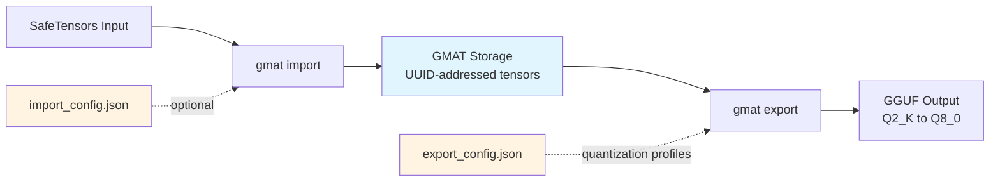

# GMAT-CLI Wiki

Welcome to the GMAT-CLI documentation hub. This wiki provides comprehensive guides for converting SafeTensors models to quantized GGUF format using CPU-only processing.

## What is GMAT-CLI?

GMAT-CLI is a CPU-only model management infrastructure that bridges the gap between model training and production inference. It converts HuggingFace SafeTensors models into an intermediate GMAT storage format, then exports them to production-ready GGUF files with fine-grained quantization control. The entire pipeline runs without GPU requirements, enabling 70B+ model processing on standard hardware through streaming architecture and bounded memory usage.

## Architecture Overview



The workflow separates model storage (GMAT) from deployment configuration (export configs), enabling:
- **Multiple quantization profiles** from a single GMAT source
- **Per-tensor quantization overrides** via export_config.json
- **Reproducible builds** with version-controlled configs
- **Block format selection** via import_config.json

## Key Concepts

### GMAT Storage Format

GMAT uses tensor-addressed storage where each tensor becomes an individual UUID-named file. This design enables:
- Tensor-level versioning and replacement
- Foundation for future deduplication across fine-tunes
- Direct tensor access without loading entire model
- Individual tensor analysis and optimization

Structure:
```
model.gmat/
├── metadata.json          # Architecture and tensor mapping
└── tensors/
    ├── <uuid>.gmat       # Individual tensor files
    └── ...
```

### Block-Sparse Encoding

Tensors are stored using block-sparse log-encoded format with configurable block sizes:
- **B8x4, B8x8** (default): 8-row blocks, 4 or 8 columns
- **B16x4, B16x8**: 16-row blocks for larger tensors
- **DualRow variants**: Memory-optimized encoding

Block format affects intermediate storage size and processing performance. Larger blocks reduce overhead but require more contiguous memory.

### Quantization Profiles

Export configs define quantization strategies with global defaults and per-tensor overrides:

| Family | Types | Use Case |
|--------|-------|----------|
| **K-quant** | Q2_K, Q3_K_S/M/L, Q4_K_S/M, Q5_K_S/M, Q6_K | Production standard (Q4_K_M default) |
| **I-quant** | IQ4_XS, IQ4_NL | Experimental, higher quality at same size |
| **Legacy** | Q4_0, Q5_0, Q8_0 | Compatibility |

Trellis scale optimization (lambda=0.3 default) improves quantization quality with minimal speed cost.

## Getting Started

Follow these guides in order:

1. **[Installation](Installation.md)** - Prerequisites, Rust setup, build/install, verification
2. **[Import Command](Import-Command.md)** - Convert SafeTensors to GMAT storage
3. **[Export Command](Export-Command.md)** - Generate quantized GGUF from GMAT
4. **[Configuration Files](Configuration-Files.md)** - Customize import/export behavior

## Wiki Documentation

| Page | Description |
|------|-------------|
| [Installation](Installation.md) | System requirements (Rust 1.70+, 4+ CPU cores, 8GB+ RAM), installation methods, troubleshooting |
| [Import Command](Import-Command.md) | SafeTensors→GMAT conversion, config generation, block format selection, sharded input handling |
| [Export Command](Export-Command.md) | GMAT→GGUF export, quantization type reference, per-tensor overrides, sharding output, Trellis optimization |
| [Configuration Files](Configuration-Files.md) | import_config.json and export_config.json schemas, examples, config generation workflow |
| [Technical Details](Technical-Details.md) | Block encoding algorithms, quantization deep-dive (K-quant, I-quant), memory efficiency, hardware requirements |
| [FAQ](FAQ.md) | Common questions by category: General, Installation, Import, Export, Performance, Quantization, Troubleshooting |

## Quick Links

**Common Tasks:**

- [Install GMAT-CLI](Installation.md#installation-methods)
- [Import your first model](Import-Command.md#basic-usage)
- [Generate export config](Export-Command.md#config-generation)
- [Choose quantization type](Export-Command.md#quantization-types)
- [Override specific tensors](Configuration-Files.md#per-tensor-overrides)
- [Process large models (70B+)](Technical-Details.md#memory-efficiency)
- [Troubleshoot memory issues](FAQ.md#performance)

**Reference:**

- [Supported architectures](Technical-Details.md#supported-architectures)
- [Block format comparison](Technical-Details.md#block-encoding)
- [Quantization quality/speed tradeoffs](Export-Command.md#quantization-types)
- [Hardware recommendations](Technical-Details.md#hardware-requirements)

---

For quick setup instructions, see the main [README](../README.md). For development and contribution, see [CONTRIBUTING](../CONTRIBUTING.md).
