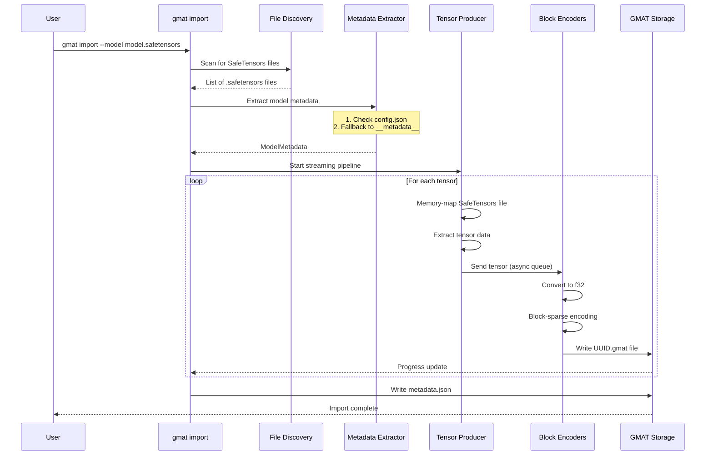

# Import Command

## Purpose

The `import` command converts SafeTensors models into GMAT's intermediate storage format. This conversion transforms standard model weight files into a block-sparse, UUID-addressed tensor storage system optimized for subsequent quantization and export operations.

**Workflow**: SafeTensors → GMAT Storage (block-encoded tensors)

## Import Process Flow



## Command Syntax

```bash
gmat import [OPTIONS]
```

### Basic Usage

```bash
# Import with auto-generated config
gmat import --model ./model.safetensors --output ./output

# Import with custom config
gmat import --model ./model.safetensors --config import_config.json --output ./output
```

## Options

| Option | Short | Type | Required | Description |
|--------|-------|------|----------|-------------|
| `--model <PATH>` | `-m` | String | Yes | Path to SafeTensors model file or directory containing sharded files |
| `--config <PATH>` | `-c` | String | No | Path to `import_config.json`. If not provided, uses defaults (includes all tensors, B8x8 format) |
| `--output <PATH>` | `-o` | String | No | Output directory for `.gmat` model. Default: `output/` |
| `--generate-config` | | Flag | No | Generate `import_config.json` template instead of importing. Scans model and creates config with UUIDs and metadata |

## Examples

### Example 1: Basic Import

Import a SafeTensors model with default settings:

```bash
gmat import --model ./tiny_llm.safetensors --output ./converted
```

**What happens**:
- Uses default block format (`B8x8`)
- Includes all tensors from the model
- Creates `converted/model.gmat/` directory
- Generates UUID for each tensor automatically

### Example 2: Import with Config Generation

First generate a config template, then customize and import:

```bash
# Step 1: Generate config template
gmat import --model ./llama-7b.safetensors --generate-config

# Step 2: Edit import_config.json (optional)
# - Set include: false for tensors to skip
# - Change block_format if needed
# - Verify metadata

# Step 3: Run import
gmat import --model ./llama-7b.safetensors --config import_config.json --output ./output
```

**Config generation output**:
```
Found 1 safetensors file(s)
Processed 1/1 files (291 tensors)...

=== Tensor Statistics ===
Total tensors: 291
Total elements: 6738415616 (6.74 B)
Total size: 12.52 GB (12.52 GB)

Shape distribution:
  1D tensors: 35
  2D tensors: 256
  3D tensors: 0
  4D+ tensors: 0
  Min elements: 4096
  Max elements: 131072000 (131.07 M)

Data types:
  F32: 291

=== Generated import_config.json ===
Tensors: 291
Architecture: LlamaForCausalLM

Edit the config, then run:
  gmat import --model ./llama-7b.safetensors --config import_config.json
```

### Example 3: Sharded Model Import

Import multi-file sharded SafeTensors (common for large models like 70B):

```bash
# Directory contains: model-00001-of-00015.safetensors, model-00002-of-00015.safetensors, ...
gmat import --model ./llama-70b/ --output ./llama-70b-gmat
```

**What happens**:
- Automatically discovers all `.safetensors` files in directory
- Processes shards sequentially using streaming pipeline
- Deduplicates tensor names across shards
- Creates single unified `.gmat` storage

### Example 4: Custom Block Format

Generate config and modify block format for specific use case:

```bash
# Generate template
gmat import --model ./model.safetensors --generate-config

# Edit import_config.json, change "block_format": "B8x8" to "B16x8"

# Import with custom block format
gmat import --model ./model.safetensors --config import_config.json
```

## Output Structure

The import process creates a `.gmat` directory with the following structure:

```
output/model.gmat/
├── metadata.json          # Model configuration and tensor mappings
├── tokens.bin             # Tokenizer vocabulary (binary tree format)
└── tensors/
    ├── <uuid1>.gmat       # Individual tensor file (block-sparse encoded)
    ├── <uuid2>.gmat
    ├── <uuid3>.gmat
    └── ...
```

### Tokenizer Processing

During import, GMAT automatically discovers and processes tokenizer files from the model directory:

**Supported formats:**
- **HuggingFace JSON**: `tokenizer.json` + `tokenizer_config.json`
- **Tiktoken**: Base64-encoded mergeable ranks files

**Output:** `tokens.bin` contains the vocabulary in a binary tree format optimized for GGUF embedding.

**Special tokens:** Automatically extracted from tokenizer config (BOS, EOS, PAD, UNK, etc.) and stored for export.

### metadata.json Structure

```json
{
  "config": {
    "source_format": "safetensors",
    "block_format": "B8x8",
    "tensor_map": [
      {
        "source": "model.embed_tokens.weight",
        "target": "a1b2c3d4-e5f6-7890-abcd-ef1234567890",
        "include": true
      }
    ],
    "metadata": {
      "architecture": "LlamaForCausalLM",
      "vocab_size": 32000,
      "hidden_size": 4096,
      "num_layers": 32
    }
  },
  "tensor_name_map": {
    "model.embed_tokens.weight": "a1b2c3d4-e5f6-7890-abcd-ef1234567890"
  },
  "total_tensors": 291
}
```

### Tensor File Format

Each `.gmat` file stores a single tensor in block-sparse format:
- **Header**: Metadata (rows, cols, block format, sparsity)
- **Blocks**: Only non-empty blocks stored (1-2 bytes overhead for empty blocks)
- **Encoding**: Log-domain magnitude representation (e0m4 or e1m7)
- **Sparsity**: Automatic detection and optimization

## Auto-Generated Config

The `--generate-config` flag creates an `import_config.json` template with:

### 1. Tensor Mappings

Every tensor discovered in the model is assigned:
- **Source name**: Original tensor name from SafeTensors
- **Target UUID**: Unique identifier for GMAT storage
- **Include flag**: Set to `true` by default (can be changed to skip tensors)

### 2. Model Metadata

Automatically extracted from (in order of priority):

1. **config.json** (HuggingFace format)
   - Located in same directory as model file
   - Extracts: architecture, vocab_size, hidden_size, num_layers, num_attention_heads, etc.
   - Supports nested configs for Vision-Language Models (text_config, language_config)
   - Handles encoder-decoder models (d_model, decoder_layers)

2. **SafeTensors __metadata__** (fallback)
   - Embedded metadata in `.safetensors` header
   - Less comprehensive than config.json

### Supported Metadata Fields

| Field | Aliases | Description |
|-------|---------|-------------|
| `architecture` | `model_type`, `architectures[0]` | Model architecture (e.g., "LlamaForCausalLM") |
| `vocab_size` | | Vocabulary size |
| `hidden_size` | `d_model` | Hidden dimension size |
| `num_layers` | `num_hidden_layers`, `decoder_layers`, `n_layer` | Number of transformer layers |
| `num_attention_heads` | `num_heads`, `decoder_attention_heads`, `n_head` | Number of attention heads |
| `intermediate_size` | `d_ff`, `decoder_ffn_dim` | FFN intermediate dimension |
| `max_position_embeddings` | `n_positions`, `max_target_positions` | Maximum sequence length |

## Block Format Options

Choose a block format based on model architecture and memory/quality tradeoffs:

| Format | Block Size | Description | Best For |
|--------|------------|-------------|----------|
| `B8x4` | 8×4 = 32 elements | Smallest blocks, highest sparsity benefit | Small embedding layers, sparse models |
| `B8x8` | 8×8 = 64 elements | **Default**, balanced size/performance | General purpose, most models |
| `B16x4` | 16×4 = 64 elements | Taller blocks | Models with specific weight patterns |
| `B16x8` | 16×8 = 128 elements | Larger blocks, lower overhead | Large dense tensors |
| `DualRow8x4` | 8×4 dual-row variant | Alternative encoding | Experimental |
| `DualRow8x8` | 8×8 dual-row variant | Alternative encoding | Experimental |
| `DualRow16x4` | 16×4 dual-row variant | Alternative encoding | Experimental |
| `DualRow16x8` | 16×8 dual-row variant | Alternative encoding | Experimental |

**Recommendation**: Start with `B8x8` (default). Only change if you have specific requirements or are experimenting with sparsity optimization.

## Memory Efficiency

The import process uses a streaming architecture to handle models larger than available RAM:

### Producer-Consumer Pipeline

```
SafeTensors (mmap) → Producer → Bounded Queue → Worker Pool (Rayon) → Disk Writer
                                 (2 × CPU cores)
```

**Key features**:
- **Memory-mapped I/O**: SafeTensors files are memory-mapped, not fully loaded
- **Bounded buffer**: Only `2 × CPU_CORES` tensors in memory at once (configurable via `GMAT_BUFFER_SIZE`)
- **Parallel encoding**: Block encoding runs on Rayon threadpool (CPU parallelism)
- **Streaming writes**: Tensors written to disk immediately after conversion
- **No GPU required**: Pure CPU implementation

### Memory Usage Example

For a 70B parameter model (~140GB SafeTensors):
- **Traditional approach**: Requires >140GB RAM
- **GMAT streaming import**: Requires ~8-16GB RAM (only buffer in memory)

## Supported Input Formats

| Format | Support | Notes |
|--------|---------|-------|
| **SafeTensors** (`.safetensors`) | Full | Primary format, recommended |
| **Sharded SafeTensors** | Full | Automatically discovered and merged |
| **GGUF** | Partial | Read-only support (not documented) |

### Sharded SafeTensors

Multi-file sharded models are automatically handled:
- Files matching pattern: `model-00001-of-00015.safetensors`, etc.
- Directory scanning: Pass directory path to `--model`
- Automatic merging: All shards processed into unified GMAT storage

## Troubleshooting

### Import Fails with "Out of Memory"

**Symptom**: Process crashes with OOM error during import

**Solutions**:
1. Reduce buffer size: `export GMAT_BUFFER_SIZE=4` (default is `2 × CPU_CORES`)
2. Close other applications to free RAM
3. For 70B+ models, ensure you have at least 32GB RAM
4. Check system swap space is available

### "Failed to parse metadata.json"

**Symptom**: Error reading existing GMAT model metadata

**Solutions**:
1. Verify `metadata.json` is valid JSON (not corrupted)
2. Check file permissions
3. If upgrading from old GMAT version, regenerate with `--generate-config`

### "Unknown block format" Error

**Symptom**: Invalid block format specified in config

**Solutions**:
1. Valid formats: `B8x4`, `B8x8`, `B16x4`, `B16x8`, `DualRow8x4`, `DualRow8x8`, `DualRow16x4`, `DualRow16x8`
2. Format names are case-sensitive (use capital B)
3. If unsure, use default `B8x8`

### Import Hangs or Runs Very Slowly

**Symptom**: Import progress stalls or takes excessive time

**Solutions**:
1. Check CPU usage (should be high during import - parallel processing)
2. Verify disk I/O not bottlenecked (use NVMe SSD for best performance)
3. For networked storage, copy SafeTensors locally first
4. Check if antivirus is scanning .gmat files during write

### Sharded Model Not Detected

**Symptom**: Only processes one shard instead of all files

**Solutions**:
1. Ensure `--model` points to directory, not individual file
2. Verify all shards have `.safetensors` extension
3. Check file naming follows pattern: `model-00001-of-00015.safetensors`
4. Use `--generate-config` to see detected files

### Missing Metadata in Generated Config

**Symptom**: `metadata` section is empty or incomplete in `import_config.json`

**Solutions**:
1. Add `config.json` to same directory as model file
2. If using custom format, manually edit `import_config.json` metadata section
3. Metadata is optional - import will still work, but export may require manual architecture specification

## Next Steps

After importing to GMAT format, you can:

1. **Export to GGUF**: Convert GMAT to quantized GGUF format
   - See: [Export Command](Export-Command.md)
   - Supports Q2_K through Q8_0 quantization
   - Per-tensor quantization control

2. **Configure quantization profiles**: Create export configs for different use cases
   - See: [Configuration Files](Configuration-Files.md)
   - Per-layer quality control
   - Sharding configuration

3. **Inspect GMAT storage**: Examine intermediate format
   - Review `metadata.json` for tensor mappings
   - Check `.gmat` files for sparsity statistics

---

**See Also**:
- [Export Command](Export-Command.md) - Convert GMAT to GGUF with quantization
- [Configuration Files](Configuration-Files.md) - Detailed config schema and examples
- [Installation](Installation.md) - Hardware requirements and setup
- [FAQ](FAQ.md) - Common questions and answers
