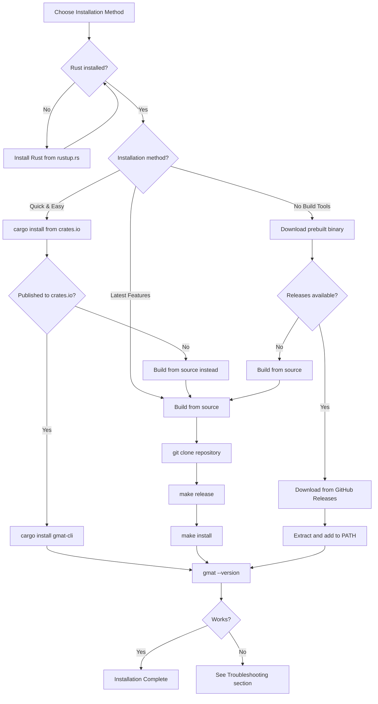

# Installation

GMAT-CLI is a pure CPU tool with no GPU, CUDA, or special driver requirements. This guide covers installation methods, hardware requirements, and troubleshooting.

## Prerequisites

### Rust Toolchain

- **Rust 1.70 or later** (check with `rustc --version`)
- **Cargo package manager** (included with Rust)
- Install from [rustup.rs](https://rustup.rs)

### Platform Support

| Platform | Status | Notes |
|----------|--------|-------|
| **Linux** | Fully supported | Best I/O performance |
| **macOS** | Fully supported | Intel and Apple Silicon (ARM64) |
| **Windows** | WSL2 only | Native Windows not tested |

### Hardware Requirements

See the [Hardware Requirements](#hardware-requirements) section below for detailed specifications.

## Installation Decision Tree



## Installation Methods

### Method 1: From crates.io (Recommended)

The easiest way to install if the package is published to [crates.io](https://crates.io):

```bash
cargo install gmat-cli
```

This installs the latest published release to `~/.cargo/bin/gmat`.

**Note:** If the package is not yet published to crates.io, use Method 2 (build from source).

### Method 2: Build from Source

Build the latest development version from the GitHub repository:

#### Clone the Repository

```bash
git clone https://github.com/yourusername/gmat-cli.git
cd gmat-cli
```

#### Build and Install

##### Debug Build (faster compilation, slower runtime)

```bash
make build
```

##### Release Build (optimized for performance)

```bash
make release
```

##### Install to Default Location (~/.cargo/bin)

```bash
make install
```

##### Install to Custom Directory

```bash
make install INSTALL_DIR=/usr/local/bin
```

#### Run Without Installing

```bash
make run ARGS="--help"
make run ARGS="import --model ./model.safetensors --generate-config"
```

### Method 3: Prebuilt Binaries

If available, download prebuilt binaries from the [GitHub Releases](https://github.com/yourusername/gmat-cli/releases) page.

#### Linux/macOS

```bash
# Download the release archive
wget https://github.com/yourusername/gmat-cli/releases/download/v0.x.x/gmat-cli-linux-x64.tar.gz

# Extract
tar -xzf gmat-cli-linux-x64.tar.gz

# Move to PATH
sudo mv gmat /usr/local/bin/

# Make executable
sudo chmod +x /usr/local/bin/gmat
```

#### Windows (WSL2)

Download the Linux binary and follow the Linux instructions inside WSL2.

## Hardware Requirements

### Model Size Tiers

| Model Size | CPU Cores | RAM | Storage | Notes |
|------------|-----------|-----|---------|-------|
| **7B models** | 4+ cores | 8 GB | ~20 GB | Entry-level hardware |
| **13B models** | 4+ cores | 16 GB | ~40 GB | Mainstream workstation |
| **70B+ models** | 8+ cores | 32 GB | ~200 GB | High-end CPU recommended |

### Detailed Requirements

#### CPU

- **Minimum:** 4 cores (x86_64 or ARM64)
- **Recommended:** 8+ cores for 70B+ models
- Parallel processing via Rayon scales with available cores
- No GPU required

#### RAM

- **Minimum:** 8 GB for small models (7B)
- **Recommended:** 16 GB for 13B models, 32 GB for 70B+ models
- Memory usage is bounded via streaming pipelines
- RAM requirements don't scale linearly with model size

#### Storage

- **Space:** 2-3× model size (source + GMAT intermediate + GGUF output)
- **Type:** NVMe SSD recommended for large models
- HDD works but significantly slower for I/O-intensive operations
- Example: 70B model requires ~200 GB free space

#### Operating System

- **Linux:** Fully supported, best I/O performance
- **macOS:** Fully supported (Intel and Apple Silicon)
- **Windows:** WSL2 only (native Windows not tested)

### Performance Notes

- **Memory-mapped I/O:** Efficient file access for large tensors
- **Streaming architecture:** Bounded memory usage regardless of model size
- **Parallel processing:** Scales with CPU core count
- **No GPU overhead:** Runs on any CPU, no driver dependencies

## Verification Steps

After installation, verify that GMAT-CLI is correctly installed:

### Check Version

```bash
gmat --version
```

Expected output (version number may vary):

```
gmat-cli 0.1.0
```

### Test Help Command

```bash
gmat --help
```

Expected output:

```
CLI tool for importing and exporting GMAT model files

Usage: gmat <COMMAND>

Commands:
  import  Import a SafeTensors/GGUF model to GMAT format
  export  Export a GMAT model to GGUF format
  help    Print this message or the help of the given subcommand(s)

Options:
  -h, --help  Print help
```

### Test Import Command (Quick Check)

```bash
# Generate a sample import config (assumes you have a SafeTensors model)
gmat import --model ./path/to/model.safetensors --generate-config

# This should create import_config.json without errors
```

If the above commands work, installation was successful.

## Troubleshooting

### Command Not Found: gmat

**Symptom:** `bash: gmat: command not found`

**Solutions:**

1. Ensure `~/.cargo/bin` is in your PATH:

   ```bash
   export PATH="$HOME/.cargo/bin:$PATH"
   ```

   Add this line to `~/.bashrc` or `~/.zshrc` to make it permanent.

2. Verify the binary exists:

   ```bash
   ls ~/.cargo/bin/gmat
   ```

3. If installed to a custom directory, ensure that directory is in PATH.

### Rust Version Too Old

**Symptom:** Compilation errors mentioning unsupported syntax or features.

**Solution:** Update Rust to version 1.70 or later:

```bash
rustup update
rustc --version
```

### Out of Memory During Build

**Symptom:** Build fails with "out of memory" error.

**Solutions:**

1. Build with fewer parallel jobs:

   ```bash
   cargo build --release -j 2
   ```

2. Increase system swap space.

3. Close other applications to free RAM.

### Compilation Errors

**Symptom:** Build fails with dependency or compilation errors.

**Solutions:**

1. Clean build artifacts and retry:

   ```bash
   make clean
   make release
   ```

2. Update dependencies:

   ```bash
   cargo update
   cargo build --release
   ```

3. Check GitHub Issues for known build problems.

### Slow Performance

**Symptom:** Import/export operations are very slow.

**Solutions:**

1. Use release build instead of debug build:

   ```bash
   make release
   make install
   ```

2. Ensure sufficient free disk space (3× model size).

3. Use NVMe SSD instead of HDD for large models.

4. Increase CPU core count or close background processes.

### Windows Native Installation

**Symptom:** Attempting to build on Windows outside WSL2.

**Solution:** Windows native builds are not officially supported. Use WSL2:

1. Install WSL2: [Microsoft WSL2 Installation Guide](https://learn.microsoft.com/en-us/windows/wsl/install)
2. Install Ubuntu or another Linux distribution
3. Follow the Linux installation instructions inside WSL2

### Permission Denied on Install

**Symptom:** `make install` fails with permission errors.

**Solutions:**

1. Install to user directory (default):

   ```bash
   make install
   ```

2. For system-wide installation, use sudo:

   ```bash
   sudo make install INSTALL_DIR=/usr/local/bin
   ```

3. Ensure the installation directory is writable.

## Next Steps

Once installation is complete, proceed to:

- **[Import Command](Import-Command)** - Learn how to convert SafeTensors models to GMAT format
- **[Export Command](Export-Command)** - Learn how to export GMAT models to quantized GGUF format
- **[Configuration Files](Configuration-Files)** - Customize import and export behavior with JSON configs
- **[FAQ](FAQ)** - Common questions and answers

## Development Commands

For developers contributing to GMAT-CLI:

| Command | Description |
|---------|-------------|
| `make build` | Build debug binary (fast compilation) |
| `make release` | Build optimized release binary |
| `make test` | Run all tests |
| `make lint` | Run clippy lints |
| `make fmt` | Format code |
| `make fmt-check` | Check code formatting without modifying |
| `make clean` | Remove build artifacts |
| `make doc` | Build and open documentation |
| `make check` | Check compilation without building |
| `make uninstall` | Remove installed binary |

## Uninstalling

To remove GMAT-CLI:

```bash
make uninstall
```

Or manually:

```bash
rm ~/.cargo/bin/gmat
```

If installed to a custom directory, remove the binary from that location.
