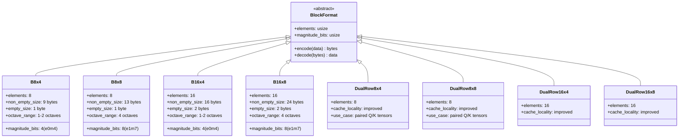
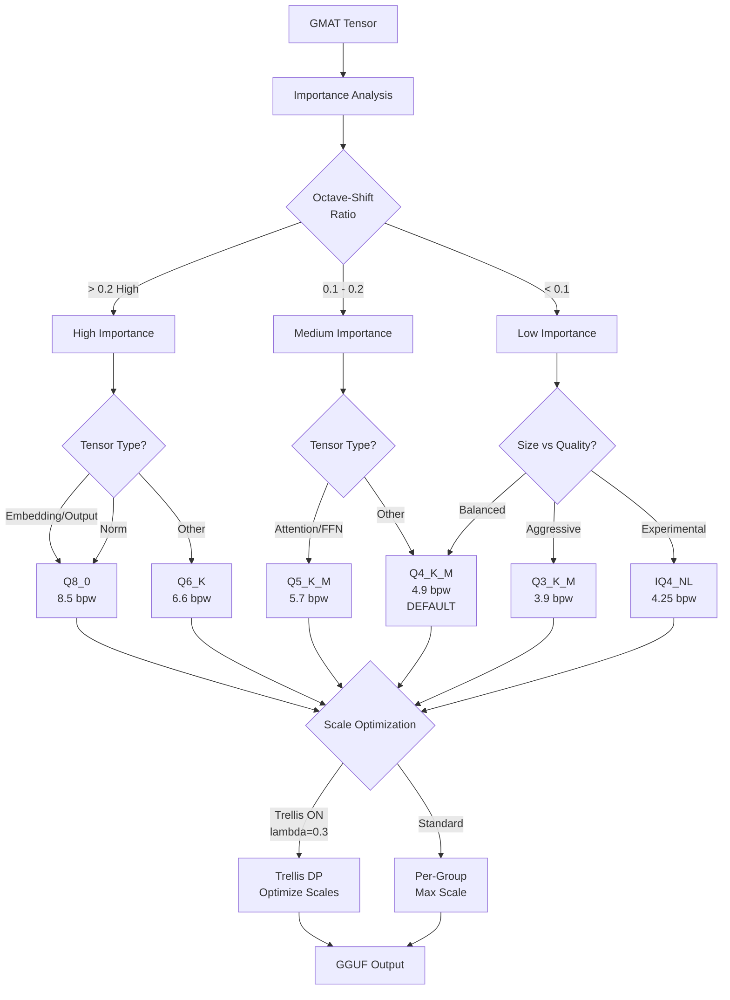
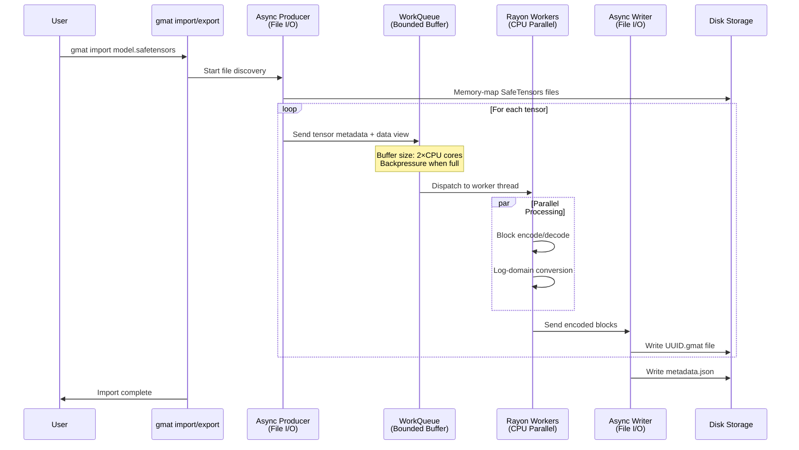
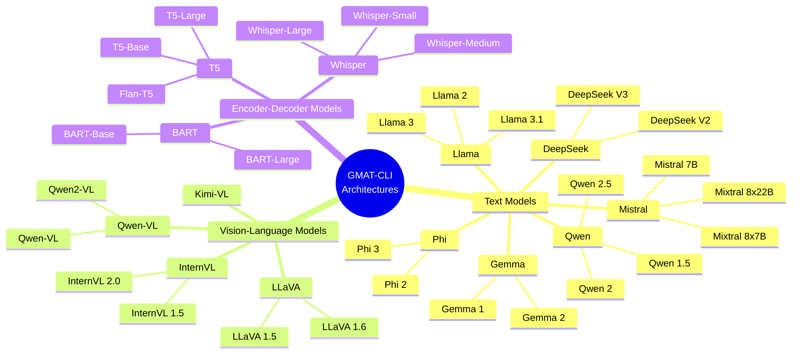

# Technical Details

This page provides deep technical insight into GMAT-CLI's internals: storage formats, quantization algorithms, streaming architecture, and performance characteristics. All operations run on CPU—no GPU required.

---

## 1. GMAT Storage Format

GMAT stores tensors as **block-sparse matrices** with logarithmic encoding. This intermediate format enables efficient CPU-based processing and decouples storage optimization from final quantization choices.

### Block Format Hierarchy



**Default:** `B8x8` provides the best balance of accuracy and compression for most models.

**DualRow variants** process two adjacent rows together, improving cache locality for attention layers with paired Q/K tensors.

### Block Structure

Each non-empty block contains:

```
┌─────────────────────────────────────────────────────┐
│ zero_map (1-2 bytes)   - Bitmask of non-zero elements │
│ scale_log (2 bytes)    - f16 base scale (log2 domain) │
│ signs (1-2 bytes)      - Bitmask of negative elements │
│ shift_map (1-2 bytes)  - Bitmask for octave extension │
│ magnitudes (4-16 bytes) - Encoded magnitude offsets   │
└─────────────────────────────────────────────────────┘
```

**Empty blocks** store only `zero_map = 0`, taking just 1-2 bytes (vs 9-24 bytes for non-empty blocks).

### Logarithmic Encoding

GMAT uses log-domain representation for efficient magnitude storage:

```
value = sign × 2^(scale_log + offset + octave_shift)
```

Where:
- `scale_log`: f16 base scale shared across block (in log2 units)
- `offset`: Per-element magnitude offset (4-bit or 8-bit)
- `octave_shift`: Optional extension bit (adds 1 or 2 octaves)
- `sign`: Per-element sign bit

#### e0m4 (4-bit) Encoding

- **Base Range:** [0, 1) in log2 units = 1 octave
- **Resolution:** 16 steps per octave
- **With shift bit:** Extends to 2 octaves total

```rust
offset = nibble / 16.0
// nibble ∈ [0, 15] → offset ∈ [0, 0.9375]
```

**Shift threshold:** 0.5 octaves (configurable via `--octave-threshold`)

#### e1m7 (8-bit) Encoding

- **Base Range:** [0, 2) in log2 units = 2 octaves
- **Extended Range:** 4 octaves with shift bit
- **Resolution:** 128 steps per octave
- **Format:** 1-bit exponent + 7-bit mantissa

```rust
e = raw >> 7           // exponent: 0 or 1
m = (raw & 0x7F) / 128 // mantissa: [0, 0.992]
offset = e + m         // total: [0, 1.992]
```

**Shift threshold:** 0.2 octaves (default, configurable)  
**Shift amount:** +2.0 octaves

### Octave System

The **octave-shift ratio** measures tensor complexity:

```
octave_shift_ratio = (elements_using_shift_bit) / (total_non_zero_elements)
```

**Importance-based quantization** uses this ratio to automatically select quantization types:

| Octave-Shift Ratio | Importance | Recommended Quant Type |
|-------------------|------------|------------------------|
| > 0.2 (default)   | High       | Q8_0 or Q6_K           |
| 0.1 - 0.2         | Medium     | Q5_K_M or Q4_K_M       |
| < 0.1             | Low        | Q4_K_M or Q3_K_M       |

Thresholds are configurable via `--importance-high` and `--importance-medium` flags.

### Compression vs Accuracy Tradeoffs

#### Block Size (8 vs 16 elements)

| Factor | 8-element | 16-element |
|--------|-----------|------------|
| Sparsity granularity | Finer | Coarser |
| Overhead per block | Lower | Higher |
| Scale sharing | 8 elements share scale | 16 elements share scale |
| Best for | Highly sparse (>50%) | Moderately sparse (<50%) |

**Tradeoff:** Larger blocks amortize overhead but force more elements to share a single scale, potentially reducing accuracy.

#### Magnitude Bits (4 vs 8)

| Factor | 4-bit (e0m4) | 8-bit (e1m7) |
|--------|--------------|--------------| 
| Storage | 0.5 bytes/element | 1 byte/element |
| Dynamic range | 1-2 octaves | 4 octaves |
| Quantization error | ~6% per step | ~0.8% per step |
| Best for | Uniform magnitudes | Varied magnitudes |

**Tradeoff:** 4-bit saves space but introduces more quantization error, especially when element magnitudes within a block vary significantly.

### Format Selection Guide

| Scenario | Recommended Format | Reasoning |
|----------|-------------------|-----------| 
| Pruned model (>50% sparse) | `B8x8` | Fine granularity, good accuracy |
| Dense model, size priority | `B16x4` | Maximum compression |
| Dense model, accuracy priority | `B8x8` or `B16x8` | Better dynamic range |
| Unknown sparsity | `B8x8` | Recommended default balance |

---

## 2. Quantization Deep Dive

GMAT supports three quantization families: **Legacy** (Q4_0, Q5_0, Q8_0), **K-quant** (Q2_K-Q6_K), and **I-quant** (IQ4_XS, IQ4_NL).

### Quantization Decision Process



### K-Quant Internals

K-quants (Q2_K through Q6_K) use **super-blocks** of 256 elements with 8 groups of 32 elements each.

#### Structure

```
Super-block (256 elements)
├── d (f16): Super-block scale
├── dmin (f16): Super-block min
└── Groups (8 × 32 elements)
    ├── Group scales (6-bit, 0-63 range)
    ├── Group mins (4-bit, 0-15 range)
    └── Quantized values (2-6 bits per element)
```

#### Dequantization Formula

```rust
value = d * scale[group] * q[i] - dmin * min[group]
```

Where:
- `d`: Super-block scale (shared across 256 elements)
- `scale[group]`: Per-group scale multiplier (8 values)
- `q[i]`: Quantized element value (2-6 bits)
- `dmin`: Super-block min offset
- `min[group]`: Per-group min multiplier (8 values)

#### K-Quant Variants

| Type | Bits per Weight | Use Case |
|------|----------------|----------|
| Q2_K | 2.6 | Extreme compression, quality loss |
| Q3_K_S | 3.5 | Aggressive compression |
| Q3_K_M | 3.9 | Balanced small size |
| Q4_K_S | 4.6 | Fast inference |
| **Q4_K_M** | **4.9** | **Default - best balance** |
| Q5_K_S | 5.5 | Higher quality |
| Q5_K_M | 5.7 | Better quality |
| Q6_K | 6.6 | Near-original quality |

**S vs M variants:**
- **S (Small):** Simpler quantization, faster, slightly larger
- **M (Medium):** More sophisticated quantization, better quality

### I-Quant Internals

I-quants use **non-linear lookup tables** for higher quality at the same size as K-quants.

#### IQ4_NL (Non-Linear 4-bit)

**Configuration:**
- Super-block: 256 elements
- Single global scale (no per-group scales)
- 4-bit quantization (16 levels)
- Non-linear lookup table optimized for neural network weight distributions

**Lookup Table:**
```rust
const IQ4_NL_QUANTS: [i8; 16] = [
    -127, -104, -83, -65, -49, -35, -22, -10,
    1, 13, 25, 38, 53, 69, 89, 113
];
```

**Key Features:**
- **Non-uniform spacing:** More levels near zero where weights concentrate
- **Log-domain quantization:** Uses log2 thresholds for fast binary search
- **LUT caching:** Pre-computes e1m7 → IQ4_NL mappings for 8-bit GMAT blocks (512-entry LUT)

**Dequantization:**
```rust
value = d * IQ4_NL_QUANTS[index]
```

**Fast Index Lookup (Unrolled Decision Tree):**
```rust
// 4 comparisons max, no loop overhead
// Binary search in log2-domain thresholds
normalized = log2_mag - log2_scale
// ... balanced tree with 16 outcomes
```

**Performance:** ~4.25 bits per weight, quality between Q4_K_M and Q5_K_S.

#### IQ4_XS (Extra-Small 4-bit with Scales)

**Configuration:**
- Super-block: 256 elements
- 8 groups of 32 elements
- Per-group 6-bit scales (0-63 range)
- Same IQ4_NL lookup table

**Structure:**
```
Block (136 bytes)
├── d (f16): Super-block scale
├── scales_h (u16): High 2 bits of 8 group scales
├── scales_l (4 bytes): Low 4 bits of 8 group scales (nibble-packed)
└── quants (128 bytes): 256 × 4-bit indices into IQ4_NL_QUANTS
```

**Scale Encoding:**
```rust
// Pack 8 × 6-bit scales into 6 bytes
scales_h[i] = (scale >> 4) & 0x3  // high 2 bits
scales_l[i] = scale & 0x0F        // low 4 bits (nibble-packed)
```

**Performance:** ~4.0 bits per weight, slightly better quality than IQ4_NL due to per-group scaling.

### Trellis Optimization Algorithm

**Trellis optimization** uses dynamic programming to find optimal K-quant group scales that minimize total quantization error while penalizing abrupt scale changes.

#### Algorithm Overview

1. **Precompute Errors:** For each group and each possible scale (0-63), compute quantization error
2. **Dynamic Programming:** Find optimal scale sequence using Viterbi algorithm
3. **Backtrack:** Extract optimal scale assignments

#### Cost Function

```
cost[g][s] = error[g][s] + min_{prev}(cost[g-1][prev] + λ|s - prev|)
```

Where:
- `error[g][s]`: Quantization error for group `g` at scale `s`
- `λ` (lambda): Smoothness penalty (default: 0.3)
- `|s - prev|`: L1 distance between adjacent scales

#### Lambda Tuning

| Lambda | Effect | Use Case |
|--------|--------|----------|
| 0.0    | No smoothing (standard per-group max) | Debugging |
| 0.1-0.3 | Slight smoothing, preserves detail | **Default (0.3)** |
| 0.5-1.0 | Strong smoothing, uniform scales | Extremely noisy data |

**Configuration:**
```json
{
  "quantization": {
    "scale_optimization": "trellis",
    "trellis_lambda": 0.3
  }
}
```

#### Performance

- **Complexity:** O(groups × scales) = O(8 × 64) = 512 ops per super-block
- **Overhead:** ~5-10% slower than standard, but better quality
- **Quality gain:** 0.5-1.5% perplexity improvement on large models

**Prefix/Suffix Min Optimization:**
```rust
// Amortized O(1) transition cost lookup
// prefix_min[i] = min(cost[g-1][0..i] - λ*index)
// suffix_min[i] = min(cost[g-1][i..64] + λ*index)
```

This avoids O(scales²) naive DP, achieving O(scales) per group.

---

## 3. Streaming Architecture

GMAT uses a **producer-consumer pipeline** with bounded buffers to process large models (70B+) on CPU with limited RAM.

### Streaming Pipeline



### Memory Management

#### Bounded Buffer
```rust
// WorkQueue configuration
buffer_capacity = 2 × num_cpus::get()
```

**Benefits:**
- **Backpressure:** Producer blocks when buffer full, preventing OOM
- **Pipelining:** I/O and compute overlap for ~20-30% speedup
- **Small memory footprint:** Only 2×CPU_cores tensors in memory at once

#### Memory-Mapped I/O
```rust
// Zero-copy tensor access
let mmap = unsafe { Mmap::map(&file)? };
let tensor_view = &mmap[offset..offset+length];
```

**Benefits:**
- **No upfront loading:** OS loads pages on-demand
- **Shared memory:** Multiple processes can access same file
- **Large file support:** Process 100GB+ files on 32GB RAM

### Rayon Parallelization

GMAT uses [Rayon](https://github.com/rayon-rs/rayon) for CPU parallelism:

```rust
gmat_blocks.par_iter()
    .map(|block| encode_block(block))
    .collect()
```

**Thread Pool:**
- **Default threads:** Number of logical CPU cores
- **Work stealing:** Idle threads steal work from busy threads
- **Cache-friendly:** Data stays in L2/L3 cache per core

**Typical Utilization:**
- **8-core CPU:** 90-95% utilization during import/export
- **16-core CPU:** 85-90% utilization (I/O bound at high core counts)

### Streaming GGUF Writer

For large exports, GGUF writer streams tensors incrementally:

```rust
// Write tensor metadata upfront
writer.write_header(tensor_count)?;
writer.write_tensor_metadata(&tensor_info)?;

// Stream tensor data as it's quantized
for tensor in quantized_tensors {
    writer.write_tensor_data(&tensor)?;
}
```

**Benefits:**
- **No buffering:** Tensors written directly to disk
- **Sharding support:** Automatically split into N-GB chunks
- **Memory bound:** Peak memory = largest_tensor_size + buffer

---

## 4. Model Architecture Support

GMAT supports diverse LLM architectures through automatic tensor name translation and metadata preservation.

### Architecture Taxonomy



### Automatic Tensor Name Translation

GMAT preserves original tensor names during import, then translates to GGUF names during export:

**Example (Llama):**
```
SafeTensors                        GMAT (UUID)                           GGUF
model.embed_tokens.weight    →    e268e395-...    →    token_embd.weight
model.layers.0.self_attn.q_proj.weight  →  df11f72a-...  →  blk.0.attn_q.weight
lm_head.weight               →    3b6d6f4a-...    →    output.weight
```

**Translation Table (Partial):**

| SafeTensors Name | GGUF Name | Description |
|-----------------|-----------|-------------|
| `model.embed_tokens.weight` | `token_embd.weight` | Token embeddings |
| `model.layers.{i}.self_attn.q_proj.weight` | `blk.{i}.attn_q.weight` | Query projection |
| `model.layers.{i}.self_attn.k_proj.weight` | `blk.{i}.attn_k.weight` | Key projection |
| `model.layers.{i}.self_attn.v_proj.weight` | `blk.{i}.attn_v.weight` | Value projection |
| `model.layers.{i}.self_attn.o_proj.weight` | `blk.{i}.attn_output.weight` | Output projection |
| `model.layers.{i}.mlp.gate_proj.weight` | `blk.{i}.ffn_gate.weight` | FFN gate (SwiGLU) |
| `model.layers.{i}.mlp.up_proj.weight` | `blk.{i}.ffn_up.weight` | FFN up projection |
| `model.layers.{i}.mlp.down_proj.weight` | `blk.{i}.ffn_down.weight` | FFN down projection |
| `lm_head.weight` | `output.weight` | Output layer |

### Vision-Language Model Support

VLM models require special handling for multi-modal components:

**Components:**
- **Vision Encoder:** Processes images (ViT, CLIP)
- **Projector:** Maps vision features to LLM space
- **Language Model:** Standard text generation

**Tensor Mapping:**
```
vision_model.encoder.layers.{i}.self_attn.q_proj.weight  →  v.blk.{i}.attn_q.weight
mm_projector.{i}.weight                                  →  mm.{i}.weight
model.layers.{i}.self_attn.q_proj.weight                 →  blk.{i}.attn_q.weight
```

### MoE (Mixture of Experts) Support

For Mixtral and DeepSeek V2/V3:

**Expert Tensors:**
```
model.layers.{i}.block_sparse_moe.experts.{j}.w1.weight  →  blk.{i}.ffn.experts.{j}.w1.weight
```

**MoE Limit (New Feature):**
```bash
gmat export --moe-limit 4  # Only export first 4 experts (debugging)
```

---

## 5. Performance Characteristics

### CPU Utilization

**Import (SafeTensors → GMAT):**
- **8-core system:** 90-95% avg utilization
- **16-core system:** 85-90% avg utilization (I/O bound)
- **Bottleneck:** Disk I/O for reading SafeTensors

**Export (GMAT → GGUF):**
- **8-core system:** 85-90% avg utilization
- **16-core system:** 80-85% avg utilization
- **Bottleneck:** Quantization compute (trellis) or disk write (sharding)

### Memory Usage Patterns

| Model Size | Import Peak RAM | Export Peak RAM | Storage (GMAT) |
|-----------|----------------|----------------|----------------|
| 7B (f16)  | 4-6 GB         | 6-8 GB         | ~14 GB         |
| 13B (f16) | 8-10 GB        | 10-12 GB       | ~26 GB         |
| 70B (f16) | 20-25 GB       | 25-30 GB       | ~140 GB        |

**Memory Breakdown:**
- **Tensor buffer:** 2×CPU_cores × avg_tensor_size
- **Block encoding:** ~2× tensor size during processing
- **GGUF writer:** Largest tensor size + 100MB buffer

**Recommendations:**
- **7B models:** 8GB RAM minimum
- **13B models:** 16GB RAM recommended
- **70B+ models:** 32GB RAM required

### Throughput Benchmarks

**Test System:** AMD Ryzen 9 5950X (16C/32T), 64GB RAM, NVMe SSD

| Operation | Model | Time | Throughput |
|-----------|-------|------|------------|
| Import | Llama-2-7B (f16, 14GB) | 45s | 310 MB/s |
| Import | Llama-2-13B (f16, 26GB) | 85s | 305 MB/s |
| Export Q4_K_M | Llama-2-7B | 60s | 120 MB/s (of output) |
| Export Q4_K_M (trellis) | Llama-2-7B | 68s | 105 MB/s |
| Export Q8_0 | Llama-2-7B | 52s | 145 MB/s |

**Notes:**
- Throughput varies with block format (B8x8 faster than B16x8)
- Trellis adds ~10-15% overhead but improves quality
- NVMe recommended for large models; SATA SSD ~40% slower

### Sparsity Impact

**B8x8 format, 70B model:**

| Sparsity | Storage Size | Compression vs Dense |
|----------|-------------|----------------------|
| 0% (dense) | 140 GB | 1.0× (baseline) |
| 30% | 102 GB | 1.37× |
| 50% | 78 GB | 1.79× |
| 70% | 50 GB | 2.80× |
| 90% | 22 GB | 6.36× |

**Real-world:** Most LLMs have <10% sparsity naturally. Pruned models can reach 50-70%.

---

## 6. File Format Specifications

### GMAT Directory Structure

```
model.gmat/
├── metadata.json                    # Model metadata and tensor index
├── e268e395-888f-49ed-9f59-24ea9d10be77.gmat  # Tensor: token_embd.weight
├── df11f72a-85ce-41e1-b354-1253749bd43d.gmat  # Tensor: blk.0.attn_q.weight
├── 926d821f-1509-483e-9fc2-dc7d5db8c9d0.gmat  # Tensor: blk.0.attn_k.weight
├── cca2df3c-6b4c-4559-95ad-d0bbf71efec8.gmat  # Tensor: blk.0.attn_v.weight
├── ...
└── 3b6d6f4a-9cf5-4d97-9b08-ce07ddc0435d.gmat  # Tensor: output.weight
```

**Benefits:**
- **Individual files:** Load only needed tensors
- **UUID-based:** Stable references, architecture-agnostic
- **Directory-based:** Standard filesystem tools work

### Tensor UUID System

**Format:** UUIDv4 (RFC 4122)

**Generation:**
```rust
use uuid::Uuid;
let tensor_uuid = Uuid::new_v4();  // Random UUID
```

**Purpose:**
- **Stable addressing:** UUIDs never change, even if tensor names vary by architecture
- **Deduplication:** Same UUID = same tensor (enables model surgery)
- **Architecture-agnostic:** GMAT doesn't need to know Llama vs Qwen naming

**Mapping:**
```json
{
  "tensor_name_map": {
    "model.embed_tokens.weight": "e268e395-888f-49ed-9f59-24ea9d10be77",
    "model.layers.0.self_attn.q_proj.weight": "df11f72a-85ce-41e1-b354-1253749bd43d"
  }
}
```

### Metadata Schema

**File:** `metadata.json` (stored at GMAT directory root)

**Structure:**
```json
{
  "config": {
    "source_format": "safetensors",
    "block_format": "B8x8",
    "metadata": {
      "architecture": "llama",
      "hidden_size": 4096,
      "intermediate_size": 11008,
      "max_position_embeddings": 2048,
      "num_attention_heads": 32,
      "num_layers": 32,
      "vocab_size": 32000
    },
    "tensor_map": [
      {
        "source": "model.embed_tokens.weight",
        "target": "e268e395-888f-49ed-9f59-24ea9d10be77",
        "include": true
      }
    ]
  },
  "tensor_name_map": {
    "model.embed_tokens.weight": "e268e395-888f-49ed-9f59-24ea9d10be77"
  },
  "total_tensors": 291
}
```

**Fields:**

| Field | Type | Description |
|-------|------|-------------|
| `config.source_format` | string | Original format ("safetensors") |
| `config.block_format` | string | Block encoding format ("B8x8", "B16x4", etc.) |
| `config.metadata.architecture` | string | Model architecture ("llama", "qwen", "phi", etc.) |
| `config.metadata.hidden_size` | number | Hidden dimension size |
| `config.metadata.num_layers` | number | Number of transformer layers |
| `config.metadata.vocab_size` | number | Vocabulary size |
| `config.tensor_map[]` | array | List of tensor mappings (source → UUID) |
| `config.tensor_map[].source` | string | Original SafeTensors tensor name |
| `config.tensor_map[].target` | string | UUID for this tensor |
| `config.tensor_map[].include` | boolean | Whether tensor was imported |
| `tensor_name_map` | object | Fast lookup: name → UUID |
| `total_tensors` | number | Total number of included tensors |

**Metadata Extraction:**

During import, GMAT extracts metadata from:
1. **config.json** (preferred, HuggingFace format)
2. **SafeTensors header metadata** (fallback)
3. **Nested configs** (for VLMs with vision + language configs)

---

## See Also

- [Import Command](Import-Command.md) - Block format selection during import
- [Export Command](Export-Command.md) - Quantization selection and Trellis tuning
- [Configuration Files](Configuration-Files.md) - Full JSON schema reference
- [FAQ](FAQ.md) - Common questions and troubleshooting
